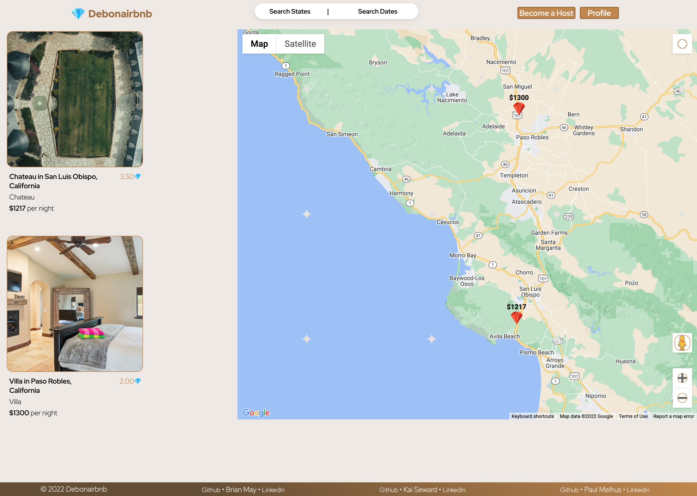
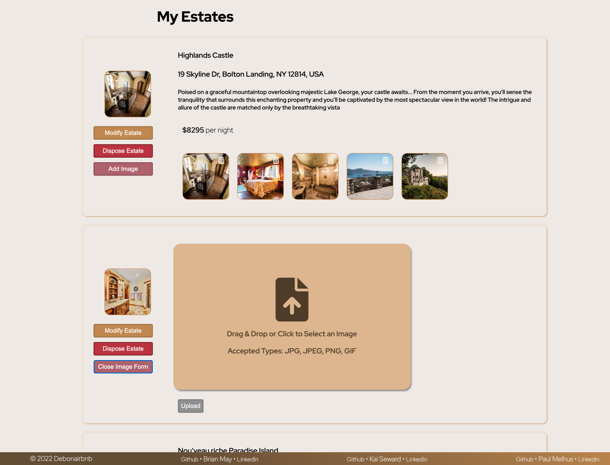

# Debonairbnb

## Debonairbnb at a Glance

Debonairbnb is a full stack application that allows patrons to book luxurious estates for their next vacation. Due to the caliber of the estates, there is an exclusivity to the app, and patrons must be logged in to get access to the website. Logged in patrons can add critiques (commonly referred to as reviews) to estates, after critiques are posted, they can edit or delete their critiques. A logged in patron can also book a charter (commonly referred to as a booking) for any available estate on the app, as well as edit or delete the charters if they change their mind. If the patron has an extra estate they are willing to rent, they can also create a listing for their estate, edit it at a later date, or delete the posting if they so decide to do so. There is a search feature implemented to find available estates for the inputted date ranges. Currently Debonairbnb is seeded with estates located in the United States. There is a Demo Patron available to browse all of the logged in features, and some extra patrons to fill out the seed data for the other aspects of the site.

## <a href='https://debonairbnb.herokuapp.com/'>Debonairbnb Live Demo </a>

### <a href='https://github.com/brianmay2014/debonairbnb/wiki'>Git Wiki</a>
 

## **_Home Page_**

 

## **_Search Page_**
&emsp; Search through all the available estates on Debonairbnb

 

## **_Estate Page_**
&emsp;  Every estate has it's own dedicated page, to gather more information, request a charter, leave a critique, and see the approximate location.

 

## **_Owned Estates Page_**
&emsp;  Every Host Patron can easily manage all of their owned estates by clicking the "Become A Host" button, or by following the My Estates link through the Profile drop down menu.

 

## Features
- Sign up / login with email.
- Logged in patrons can: 
    - Create new estate listings
    - Edit or delete their owned estates
    - Leave critiques on estates
    - Edit or delete their own critiques
    - Book a charter on estates, based on date availabilty
    - Edit or delete confirmed charters
    - Search for estates to stay in based on location or dates
- Logged out patrons:
    - Need to sign in for the exclusive estates listed on Debonairbnb
    - If they do not have an account, they'll need to become a patron

## Getting Development Environment Up And Running
- Git Clone the repo to your local machine (latest main branch repo)
- Install Dependencies:
  - While inside `/app` Run:

         pipenv install --dev -r dev-requirements.txt && pipenv install -r requirements.txt
  
  - While inside `/react-app` Run

         npm install

- Create a '.env' file that mirrors the '.env.example' file
- Create a user in your local postgreSQL database according to the .env file
- Get into the virtual environment, migrate and seed your data base

         
         pipenv shell
         flask db upgrade
         flask seed all
         

- Start servers:
  - While inside `/app` Run `pipenv shell` to get inside the virtual environment then run `flask run` to get the backend server running.
  - While inside `/react-app` Run `npm start`
- Enjoy.

## Heroku Deployment
1. Create a Heroku account if you don't have one already
2. Create a new application in the dashboard, for example "my-debonairbnb"
3. Under the "Resources" tab, click "Find More add-ons", and add "Heroku Postgres"
4. Install <a href='https://devcenter.heroku.com/articles/heroku-cli'>Heroku CLI</a>
5. Login to Heroku by running this in the terminal `heroku login`
6. When you're logged in, run `heroku authorizations:create`, and copy the GUID value for the Token key. 
7. The repo is set up with Github Actions, you'll need to set up two environment variables set up in your repo settings -> secrets -> actions. Click "New repository secret" to create these two variables:
   - `HEROKU_API_KEY` => set equal to the auth token from step 6.
   - `HEROKU_APP_NAME` => set equal to the Heroku app name you gave in step 2.
8. Back in Heroku, inside the "Settings" page of your newly created app, click on "Reveal Config Vars", and add the variables from the .env file for Heroku.
9. Whenever you push to the main branch, your Docker image will deploy the application to Heroku.
10. To seed the Heroku database, run `heroku run -a HEROKU_APP_NAME flask seed all`

## Application Architecture

Debonairbnb is built on React and Redux in the frontend with a Flask backend, using PostgreSQL as a database.

## Frontend Overview

Debonairbnb depends on backend for queries and routes, but uses the Redux store and React components for a snappy frontend.

 

### Frontend Technologies Used

#### React

Web pages of Debonairbnb are rendered using React components. It creates dynamic reusable content, with quick DOM manipulation for fast re-rendering. Used React to build JSX elements.

#### Redux

Debonairbnb uses Redux throughout to make limited backend calls for each page, and uses the Redux store to make re-renders quick whenever the store updates.

#### CSS

Debonairbnb uses CSS to style all of the HTML documents.

#### Javascript

Javascript is used on the frontend with React and Redux to create a responsive app.

 

### Backend Overview

Debonairbnb uses a Flask back-end server with PostgreSQL database. Debonairbnb also implemented features to protect user's password and information.

#### Flask

The back-end server of Debonairbnb is set up using Flask with Python.

#### WTForms

WTForms is utilized for back-end validation for all forms on the app.

#### PostgreSQL

Debonairbnb relies on PostgreSQL to maintain its relational database.

 

## Challenges and Solutions

- API Keys
  - API keys for utilizing Google Maps gave us issues many times while expanding the use of our website
  - In the end we used two different keys for the specific ways deployment used the keys in data creation in the estates model or for displaying the estates on a map
- Charters
  - The charters were a challenge due to date manipulation, and tying multiple inputs together on the same form
  - Conversion between date objects, react components, and input fields took a fair amount of time to get everything synced up with no bugs as everything communicated
  - In order to get all error handling, arrays and lists of date objects were needed for validations
  - Due to the more complicated ways users can input dates, more intricate validations were required to account for editing an estate than updating a simple text field or image link
- Heroku deployment
  - Ran into repeated issues with getting certain icons to show up in Heroku, after five attempts, we implemented the best solution that Heroku was happy with

## Conclusion and Next Steps

The next step for Debonairbnb is to add missives (commonly known as messages) between host patrons and patrons visiting an estate, along with favourite estates (likes), and user profiles
 
 
For any questions about any instructions, features, or any requested features, send us an e-mail at <a href='mailto:brianmay2014@gmail.com'>brianmay2014@gmail.com</a>, and we'll get back to you as quick as we can!

Thanks,
Brian May, Kai Seward, and Paul Melhus
